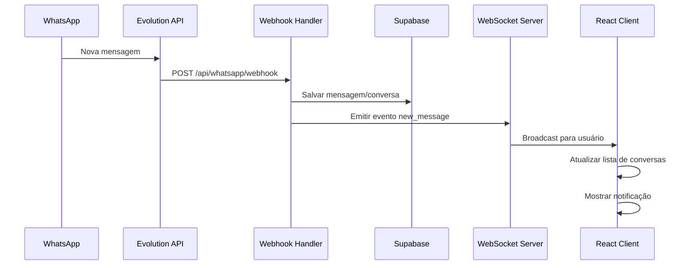
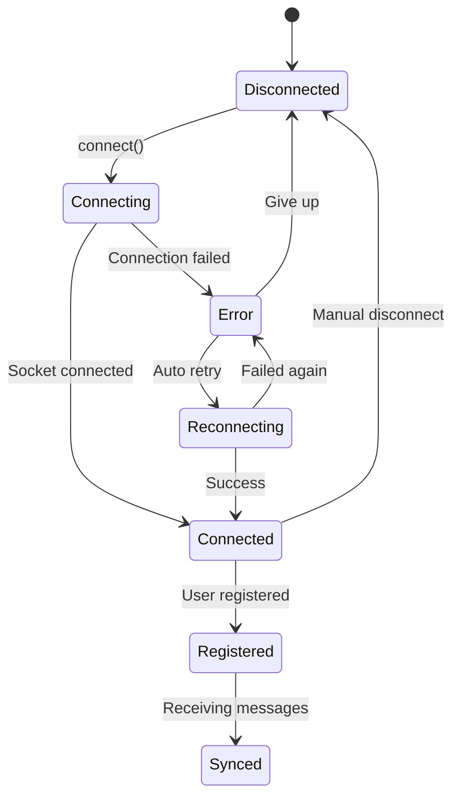

# Documento de Design - Correção de Sincronização WebSocket

## Visão Geral

O sistema atual possui uma arquitetura WebSocket funcional, mas apresenta falhas na sincronização de conversas. O problema principal é que mensagens chegam no dispositivo móvel via webhook, mas não são propagadas corretamente para o cliente web via WebSocket, resultando na mensagem "Nenhuma conversa encontrada para sincronizar".

### Análise da Arquitetura Atual

**Componentes Existentes:**
- `useWebSocket.ts`: Hook React para gerenciar conexão WebSocket
- `websocket-server.cjs`: Servidor WebSocket com Socket.IO
- `Atendimentos.tsx`: Interface principal de chat
- `ConversationList.tsx`: Lista de conversas

**Fluxo Atual:**
1. Webhook recebe mensagem da Evolution API
2. Servidor processa e salva no Supabase
3. Servidor emite evento WebSocket `new_message`
4. Cliente recebe evento mas não atualiza UI consistentemente

## Arquitetura

### Fluxo de Comunicação WebSocket



### Gerenciamento de Conexão



## Componentes e Interfaces

### Hook WebSocket Aprimorado

**Problemas Atuais:**
- Gerenciamento de callbacks é complexo com useState
- Não há mecanismo de heartbeat
- Recuperação de erro limitada
- Não há monitoramento de qualidade de conexão

**Melhorias Propostas:**
```typescript
interface WebSocketState {
  isConnected: boolean;
  connectionError: string | null;
  lastHeartbeat: Date | null;
  reconnectAttempts: number;
  connectionQuality: 'good' | 'poor' | 'disconnected';
}

interface WebSocketCallbacks {
  onNewMessage: (message: WebSocketMessage) => void;
  onConnectionUpdate: (update: ConnectionUpdate) => void;
  onQRCodeUpdate: (update: QRCodeUpdate) => void;
  onSyncComplete: (conversations: Conversation[]) => void;
}
```

### Server-Side Enhancements

**Current Issues:**
- No acknowledgment system
- Limited logging for debugging
- No message queuing for offline clients
- No heartbeat implementation

**Proposed Architecture:**
```javascript
class WebSocketManager {
  constructor() {
    this.connectedUsers = new Map();
    this.messageQueue = new Map(); // Queue messages for offline users
    this.heartbeatInterval = null;
  }

  // Enhanced user registration with acknowledgment
  registerUser(userId, socket) {
    // Implementation with proper error handling
  }

  // Message delivery with retry mechanism
  deliverMessage(userId, message) {
    // Implementation with queuing and acknowledgment
  }

  // Heartbeat system
  startHeartbeat() {
    // Implementation for connection health monitoring
  }
}
```

## Data Models

### WebSocket Message Types

```typescript
// Enhanced message structure
interface WebSocketMessage {
  id: string;
  type: 'new_message' | 'conversation_update' | 'sync_response';
  conversationId: string;
  contactId: string;
  contactName: string;
  contactPhone: string;
  messageId: string;
  content: string;
  messageType: string;
  timestamp: string;
  acknowledgmentRequired: boolean;
}

// Sync-specific messages
interface SyncRequest {
  type: 'sync_request';
  userId: string;
  lastSyncTimestamp?: string;
}

interface SyncResponse {
  type: 'sync_response';
  conversations: Conversation[];
  messages: Message[];
  syncTimestamp: string;
}
```

### Connection State Management

```typescript
interface ConnectionState {
  status: 'connecting' | 'connected' | 'registered' | 'error' | 'disconnected';
  userId: string | null;
  socketId: string | null;
  lastActivity: Date;
  heartbeatStatus: 'active' | 'missed' | 'failed';
  reconnectAttempts: number;
  maxReconnectAttempts: number;
}
```

## Error Handling

### Client-Side Error Recovery

**Connection Errors:**
1. **Network Issues**: Exponential backoff reconnection
2. **Authentication Failures**: Clear user session and redirect
3. **Server Unavailable**: Show offline mode with retry button
4. **Message Delivery Failures**: Queue messages locally and retry

**Implementation Strategy:**
```typescript
class WebSocketErrorHandler {
  handleConnectionError(error: Error) {
    switch (error.type) {
      case 'NETWORK_ERROR':
        return this.scheduleReconnect();
      case 'AUTH_ERROR':
        return this.handleAuthFailure();
      case 'SERVER_ERROR':
        return this.enterOfflineMode();
    }
  }

  scheduleReconnect() {
    const delay = Math.min(1000 * Math.pow(2, this.reconnectAttempts), 30000);
    setTimeout(() => this.attemptReconnect(), delay);
  }
}
```

### Server-Side Error Handling

**Webhook Processing Errors:**
1. **Database Failures**: Retry with exponential backoff
2. **WebSocket Delivery Failures**: Queue message for later delivery
3. **Invalid Message Format**: Log error and continue processing

**Message Queue System:**
```javascript
class MessageQueue {
  constructor() {
    this.queues = new Map(); // userId -> messages[]
    this.maxQueueSize = 100;
    this.retryInterval = 5000;
  }

  queueMessage(userId, message) {
    if (!this.queues.has(userId)) {
      this.queues.set(userId, []);
    }
    
    const queue = this.queues.get(userId);
    if (queue.length >= this.maxQueueSize) {
      queue.shift(); // Remove oldest message
    }
    
    queue.push({
      ...message,
      queuedAt: new Date(),
      retryCount: 0
    });
  }

  processQueue(userId) {
    const queue = this.queues.get(userId);
    if (!queue || queue.length === 0) return;

    // Process queued messages when user reconnects
    queue.forEach(message => {
      this.deliverMessage(userId, message);
    });
    
    this.queues.delete(userId);
  }
}
```

## Testing Strategy

### Unit Tests

**WebSocket Hook Tests:**
- Connection establishment and teardown
- Message callback registration and execution
- Error handling and recovery
- Heartbeat functionality

**Server Tests:**
- User registration and deregistration
- Message broadcasting
- Queue management
- Error scenarios

### Integration Tests

**End-to-End Flow:**
1. Webhook receives message
2. Message is saved to database
3. WebSocket broadcasts to connected clients
4. Client updates UI appropriately
5. User sees new conversation/message

**Sync Functionality:**
1. User clicks sync button
2. Client requests sync from server
3. Server returns unsynced conversations
4. Client updates conversation list
5. User sees updated conversations

### Performance Tests

**Connection Load:**
- Multiple simultaneous connections
- Message throughput under load
- Memory usage with large message queues
- Reconnection behavior under network instability

**Sync Performance:**
- Large conversation lists
- Sync with many unread messages
- Concurrent sync requests

## Implementation Phases

### Phase 1: Enhanced Logging and Debugging
- Add comprehensive logging to WebSocket events
- Implement connection state monitoring
- Add debug endpoints for troubleshooting

### Phase 2: Improved Error Handling
- Implement exponential backoff reconnection
- Add message queuing for offline users
- Enhance error reporting and recovery

### Phase 3: Sync Mechanism Overhaul
- Implement proper sync request/response flow
- Add timestamp-based sync filtering
- Optimize database queries for sync operations

### Phase 4: Connection Quality Monitoring
- Implement heartbeat system
- Add connection quality indicators
- Provide user feedback for connection issues

### Phase 5: Performance Optimization
- Optimize message broadcasting
- Implement message batching
- Add connection pooling if needed

## Monitoring and Observability

### Metrics to Track
- WebSocket connection count
- Message delivery success rate
- Sync operation frequency and duration
- Error rates by type
- Reconnection frequency

### Logging Strategy
- Structured logging with correlation IDs
- Different log levels for development vs production
- Centralized error tracking
- Performance metrics collection

### Health Checks
- WebSocket server health endpoint
- Database connectivity checks
- Message queue status monitoring
- Connection quality assessments